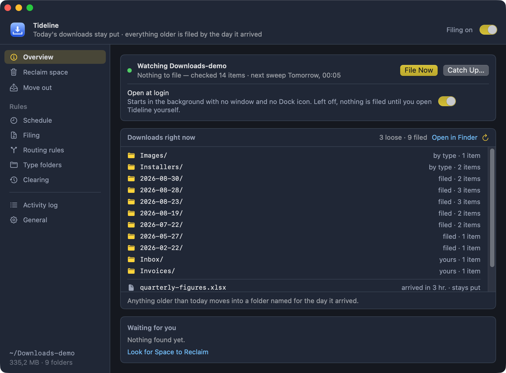

# Tideline

<picture>
  <source media="(prefers-color-scheme: light)" srcset="./assets/pitch-light.jpg">
  
</picture>

**A tidy Downloads folder, every morning, without hiding what you just
downloaded.** Today's files stay loose in the root where you expect them.
Everything older is filed into a `YYYY-MM-DD` folder named for the day it
arrived — when the day rolls over, yesterday's files move on their own.

Download the same build artifact from GitHub twice and the second one lands as
`artifact-1.zip`, the third as `artifact-2.zip`, and the name no longer tells
you anything. So you make a folder, drag the new file into it, rename it back to
what it was meant to be, and only then start working with it. Tideline is that
folder, made for you every day.

```
~/Downloads/
├── 2026-08-17/
│   └── invoice.pdf
├── 2026-08-18/
│   ├── slides.key
│   └── screenshot.png
├── report.pdf          ← downloaded today, stays put
└── archive.zip         ← downloaded today, stays put
```

**[Download for macOS](https://github.com/estruyf/tideline/releases/latest)**,
or `brew install --cask estruyf/tap/tideline` — macOS 14 or later. Free, open
source, no account, no telemetry.

**📖 [Documentation](https://estruyf.github.io/tideline/docs/)** — installing,
the first launch, and every setting in the window.
**🎬 [A ninety-second tour](https://estruyf.github.io/tideline/#tour)** — every
screen, from the first run to the menu bar.

Native Swift with no dependencies at all: 1.7 MB to download, 5.8 MB on disk
because it ships for both Apple silicon and Intel. No Electron, no bundled
runtime, no helper process quietly installed beside it — one menu bar app that
schedules itself, and quitting it really is the end of it.



> **Windows — beta.** There is a Windows build under [`windows/`](./windows):
> the same filing rules, rewritten in Rust behind a [Tauri](https://tauri.app)
> window and tray icon. Filing, type folders, the schedule and preview mode all
> work; clearing, duplicates, the big-file review and putting everything back do
> not yet, and it starts filing without asking first. It ships as a pre-release
> on its own schedule — see
> [what the Windows beta does](https://estruyf.github.io/tideline/docs/windows.html),
> or [the Windows README](./windows/README.md) for the engineering side. The
> macOS app is unaffected by any of it.

## Why

Making the folder, dragging the file in, renaming it back — none of that takes
long. It is just cumbersome, every single time.

Hence the idea: what if the Downloads folder were always clean? Not empty —
clean. Everything that came before sits in its own folder, so the moment you
download something it is the only thing in the root, under its real name, ready
to work with.

## Why it is an app and not a script

The obvious way to build this is a script on a timer. The problem is permissions:
a script runs as whatever launched it, so macOS asks *that* process for access.
In practice that means granting **Full Disk Access** to `bash`, your terminal or
launchd — a blunt, all-or-nothing switch that is awkward to explain and easy to
get wrong.

An app bundle has its own identity, so macOS asks a single, specific question:

> **"Tideline" would like to access files in your Downloads folder.**

One click, scoped to one folder, revocable in System Settings. Nothing else on
the disk becomes reachable.

## What it does

Filing is the whole of it. Everything else is there because a folder that files
itself still grows, and because nothing here should ever be a surprise.

| | |
| --- | --- |
| [Filing](https://estruyf.github.io/tideline/docs/filing.html) | One folder per day or per month, how long things stay loose, and the list of names never to touch |
| [Routing rules](https://estruyf.github.io/tideline/docs/routing-rules.html) | Folders that claim a file by its name, or by the site it came from — so an invoice is filed as an invoice |
| [Type folders](https://estruyf.github.io/tideline/docs/type-folders.html) | Send every `.dmg` to `Installers/` whatever day it arrived on |
| [Schedule](https://estruyf.github.io/tideline/docs/schedule.html) | On a folder change, once a day, when the app starts, or any combination |
| [Clearing](https://estruyf.github.io/tideline/docs/clearing.html) | Old dated folders to the Trash, once you have stopped needing them |
| [Reclaim space](https://estruyf.github.io/tideline/docs/reclaim-space.html) | Duplicates, big files and old folders — everything that could give space back |
| [Move out](https://estruyf.github.io/tideline/docs/move-out.html) | Find things across Downloads and everything already filed, then move the batch somewhere else — and put it back in one go |
| [Preview mode](https://estruyf.github.io/tideline/docs/filing.html#preview) | A sweep that touches nothing and then says what it would have done |
| [Putting it back](https://estruyf.github.io/tideline/docs/filing.html#putting-it-back) | One sheet that moves everything Tideline ever filed back into the root |

Two rules hold everywhere:

- **Nothing is ever deleted.** Removals go to the Trash, never straight to
  `unlink`. A setting you regret is a drag back out of the Trash, not a restore
  from backup.
- **Nothing is ever overwritten.** A name that is already taken counts up:
  `report.pdf`, `report-1.pdf`, `report-2.pdf`.

## Install

With [Homebrew](https://brew.sh):

```bash
brew install --cask estruyf/tap/tideline
```

Or open the disk image from the
[latest release](https://github.com/estruyf/tideline/releases/latest) and drag
**Tideline.app** onto the Applications folder beside it. The zip attached to the
same release is the same build, and is the one Tideline downloads when it
updates itself.

Either way it ends up in `/Applications`, which is where it keeps itself
current: Tideline looks for a newer release once a day and offers it. That is
also why a plain `brew upgrade` leaves it alone; the cask is marked as updating
itself, so the two never race. To take a version from Homebrew instead, name it:

```bash
brew upgrade --cask estruyf/tap/tideline
```

Nothing is filed until you say so — what the app asks the first time you open it
is on [First launch](https://estruyf.github.io/tideline/docs/first-launch.html).

## Documentation

The manual is at **[estruyf.github.io/tideline](https://estruyf.github.io/tideline/docs/)**:

- [Install](https://estruyf.github.io/tideline/docs/install.html) and [First launch](https://estruyf.github.io/tideline/docs/first-launch.html) — getting it running, and the question it asks
- [The window](https://estruyf.github.io/tideline/docs/the-window.html) — the panes, and what the colours mean
- [Filing](https://estruyf.github.io/tideline/docs/filing.html), [Routing rules](https://estruyf.github.io/tideline/docs/routing-rules.html), [Type folders](https://estruyf.github.io/tideline/docs/type-folders.html), [Schedule](https://estruyf.github.io/tideline/docs/schedule.html), [Clearing](https://estruyf.github.io/tideline/docs/clearing.html) — the rules a sweep follows
- [Reclaim space](https://estruyf.github.io/tideline/docs/reclaim-space.html) — duplicates, big files, old dated folders
- [Move out](https://estruyf.github.io/tideline/docs/move-out.html) — taking things out of Downloads, and putting a batch back
- [The menu bar](https://estruyf.github.io/tideline/docs/menu-bar.html), [General and activity](https://estruyf.github.io/tideline/docs/general.html), [Updates](https://estruyf.github.io/tideline/docs/updates.html)
- [Troubleshooting](https://estruyf.github.io/tideline/docs/troubleshooting.html) and [Uninstall](https://estruyf.github.io/tideline/docs/uninstall.html)
- [Windows (beta)](https://estruyf.github.io/tideline/docs/windows.html) — what the Windows build does, and what it does not do yet

The site is hand-written HTML in [`site/`](./site) with no build step, published
by [`pages.yml`](./.github/workflows/pages.yml). `npm run site` serves it
locally.

## Build it yourself

The app is a single SwiftPM executable and a shell script — no npm dependencies,
no project file.

- [Building](./docs/building.md) — requirements, scripts, versioning, layout
- [Signing and notarizing](./docs/signing.md) — handing a build to other Macs
- [Releasing](./docs/releasing.md) — the GitHub Actions workflow and its secrets
- [Filing behaviour](./docs/behaviour.md) — the rules both platforms implement
- [Windows](./windows/README.md) — the Tauri build, and where the two differ

What changed per version is in the [changelog](./CHANGELOG.md).

## 🔑 License

[MIT](./LICENSE)

<br />
<br />

<p align="center">
<a href="https://visitorbadge.io/status?path=https%3A%2F%2Fgithub.com%2Festruyf%2Ftideline"></a>
</p>
