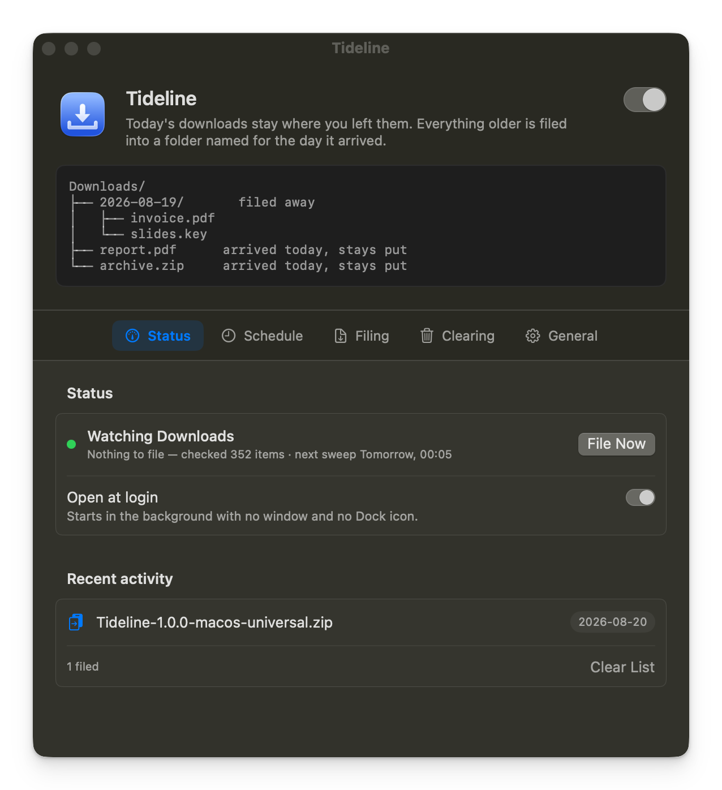

# Tideline

Keeps `~/Downloads` tidy without hiding what you just downloaded.

Today's files stay loose in the root where you expect them. Everything older
gets filed into a `YYYY-MM-DD` folder named for the day it was downloaded. When
the day rolls over, yesterday's files move into yesterday's folder on their own.

```
~/Downloads/
├── 2026-08-17/
│   └── invoice.pdf
├── 2026-08-18/
│   ├── slides.key
│   └── screenshot.png
├── report.pdf          ← downloaded today, stays put
└── archive.zip         ← downloaded today, stays put
```

macOS 13 or later. A native 1.7 MB app — no Electron, no runtime, no helper
daemon. It schedules itself and sits in the menu bar.



**[Download the latest release](https://github.com/estruyf/tideline/releases/latest)**

## Why

Downloading the same build artifact from GitHub twice is all it takes. The second
one lands as `artifact-1.zip`, the third as `artifact-2.zip`, and now the name no
longer tells you anything. So you make a folder, drag the new file into it,
rename it back to what it was meant to be, and only then start working with it.

None of that takes long. It is just cumbersome, every single time.

Hence the idea: what if the Downloads folder were always clean? Not empty —
clean. Everything that came before sits in its own folder, so the moment you
download something it is the only thing in the root, under its real name, ready
to work with.

## Why it is an app and not a script

The obvious way to build this is a script on a timer. The problem is permissions:
a script runs as whatever launched it, so macOS asks *that* process for access.
In practice that means granting **Full Disk Access** to `bash`, your terminal or
launchd — a blunt, all-or-nothing switch that is awkward to explain and easy to
get wrong.

An app bundle has its own identity, so macOS asks a single, specific question:

> **"Tideline" would like to access files in your Downloads folder.**

One click, scoped to one folder, revocable in System Settings. Nothing else on
the disk becomes reachable.

## Install

Grab the zip from the [latest release](https://github.com/estruyf/tideline/releases/latest),
unzip it, and drag **Tideline.app** into `/Applications`.

Prefer to build it yourself? See [Building](./docs/building.md).

## First launch

The window opens and the app immediately asks macOS for access to your Downloads
folder. Allow it — without it the app can see nothing and moves nothing.


If you dismissed the prompt, the window shows an orange banner with an **Open
Privacy Settings** button. Switch on *Downloads Folder* for Tideline under
**Privacy & Security › Files and Folders**, then quit and reopen the app.

The window also offers to start Tideline at login, since filing only happens
while the app is running. **Open at Login** switches it on; **Not Now** hides
the suggestion for good. Either way the same switch stays on the **Status**
tab, under the run summary.

## The window

A header that stays put — the app's name, the master on/off switch, a sketch of
how the folder will end up looking, and an orange banner if macOS is blocking
access — above five tabs. The sketch follows the folder-name setting, so
switching between daily and monthly shows its result straight away.

### Status

Whether filing is on, when it last ran, what it did, and when the next sweep is
due. **File Now** runs one immediately, and **Open at login** decides whether
Tideline is around to run at all — it starts in the background with no window
and no Dock icon. Below that, the last dozen moves, with a link to the full log
at `~/Library/Logs/Tideline.log`.

### Schedule

Any combination of:

| Setting | What it does |
| --- | --- |
| As soon as the folder changes | Watches `~/Downloads` and sweeps once things go quiet for 8 seconds |
| Once a day, at a time you pick | Default 00:05, so yesterday's files get filed on a quiet morning |
| When the app starts | Covers a scheduled run missed because the Mac was off |

A run that is missed while the Mac sleeps fires as soon as it wakes.

### Filing

| Setting | Options |
| --- | --- |
| Folder | `~/Downloads` by default; pick any folder |
| Leave loose in the root | Today only, today and yesterday, the last 3 days, the last week |
| Folder name | One folder per day (`2026-08-19`) or per month (`2026-08`) |
| Sort by | Date added to the folder (Finder's "Date Added"), date created, or date last modified |
| File folders too | Whether downloaded folders move like files |
| Preview mode | Logs what *would* move and touches nothing |

**Never touch these** — exact names (`Inbox`) or patterns (`*.dmg`). It starts
with `Inbox` and `Screenshots`; both can go. On top of your list, the app always
leaves alone: today's downloads, hidden files, partial downloads
(`.crdownload`, `.download`, `.part`, `.partial`, `.opdownload`, `.tmp`,
`.temp`, `.aria2`, Safari's `.download` bundles), anything written to in the
last 30 seconds, and the dated folders it created itself.

### Clearing

Old dated folders can go to the Trash once you have stopped
needing them. This is the one part of the app that removes something, so it is
deliberately narrow:

| Setting | Options |
| --- | --- |
| Clear dated folders | Never, or older than a month, three months (default), six months, a year |
| Always keep | The newest 1, 3 (default), 5 or 10 folders, whatever their age |
| Clear on the daily sweep | Off by default — see below |

Left as it comes, nothing is ever removed on its own: the age setting only
decides what shows up when you go looking.

**Review Old Folders…** lists everything that qualifies with its item count and
size, all of it ticked. Untick anything you want to keep, then **Move n Folders
to Trash**. Nothing is removed until you press that button.

Switching on *Clear on the daily sweep* lets it happen unattended as part of the
once-a-day run — never on a folder change, so a download landing can never
trigger a removal.

Three rules make this safe to leave on:

- Only folders matching `YYYY-MM-DD` or `YYYY-MM` — the ones Tideline made
  itself — are ever considered. Loose files, and folders you named yourself, are
  invisible to it.
- Age comes from the folder's *name*, measured from the end of the day or month
  it covers, so a folder is never cleared sooner than its name suggests. The
  folder's own timestamp is ignored; filing bumps that every time it drops
  something new inside.
- Folders go to the **Trash**, never straight to `unlink`. A setting you regret
  is a drag back out of the Trash, not a restore from backup.

Preview mode covers this too: it lists what would go and leaves it all in place.

### General

A notification when files are filed, buttons for the log and the Downloads
folder, and **Uninstall…**. Below that the version and build number (quote them
in a bug report), plus links to the
[source](https://github.com/estruyf/tideline),
[issues](https://github.com/estruyf/tideline/issues) and the author.

Nothing is ever overwritten. A name that is already taken in the target folder
becomes `report-1.pdf`, `report-2.pdf`, and so on.

## In the background

Closing the window drops the Dock icon; the app keeps running and keeps filing.
The menu bar icon stays. Its menu opens with the name and version, then the last
run, **File Downloads Now**, a **Filing Enabled** switch, **Review Old
Folders…**, **Open Downloads Folder**, **Settings…**, **Send Feedback…** and
**Quit**.

**Review Old Folders…** brings the window up on the review sheet rather than
clearing anything where you cannot see it; it is greyed out while clearing is
set to *Never*.

Launched at login it starts with no window and no Dock icon at all. Clicking the
app in Finder or Launchpad brings the window back.

## Uninstall

In the app: **General › Other › Uninstall…**. It removes the login item, its
settings, the history and the log, then quits and opens Finder on the app so you
can drag it to the Trash.

By hand, if you would rather:

```bash
osascript -e 'quit app "Tideline"'
rm -rf "/Applications/Tideline.app"
rm -rf "$HOME/Library/Application Support/Tideline"
rm -f  "$HOME/Library/Logs/Tideline.log"
defaults delete be.eliostruyf.Tideline
```

Then, optionally, remove the leftovers macOS keeps:

- **System Settings › General › Login Items** — remove Tideline if it is
  still listed.
- **System Settings › Privacy & Security › Files and Folders** — remove its
  Downloads Folder permission.

Your downloads and every dated folder stay exactly where they are. Uninstalling
never moves a file back.

## Troubleshooting

**Nothing moves.** Check the Status row in the app. An orange dot means macOS is
blocking access — see [First launch](#first-launch). A grey dot means filing is
paused.

**Files are filed under the wrong day.** The day comes from the date the file
landed on disk, so something copied or restored from elsewhere carries the date
of the copy. Switch *Sort by* to *Date last modified* if that suits you better.

**A file stayed put that should have moved.** Anything written to in the last 30
seconds is left alone, on the assumption that something is still filling it in.
The next sweep picks it up.

**"Unable to expand … It is in an unsupported format."** You downloaded the
build artifact from the Actions run page rather than the zip attached to the
release. GitHub wraps every artifact in a zip of its own, so that download is a
zip inside a zip — unpack it twice. Take the asset from the
[latest release](https://github.com/estruyf/tideline/releases/latest) instead;
it is the app, zipped once.

## Build it yourself

The app is a single SwiftPM executable and a shell script — no npm dependencies,
no project file.

- [Building](./docs/building.md) — requirements, scripts, versioning, layout
- [Signing and notarizing](./docs/signing.md) — handing a build to other Macs
- [Releasing](./docs/releasing.md) — the GitHub Actions workflow and its secrets

What changed per version is in the [changelog](./CHANGELOG.md).

## 🔑 License

[MIT](./LICENSE)

<br />
<br />

<p align="center">
<a href="https://visitorbadge.io/status?path=https%3A%2F%2Fgithub.com%2Festruyf%2Ftideline"></a>
</p>
