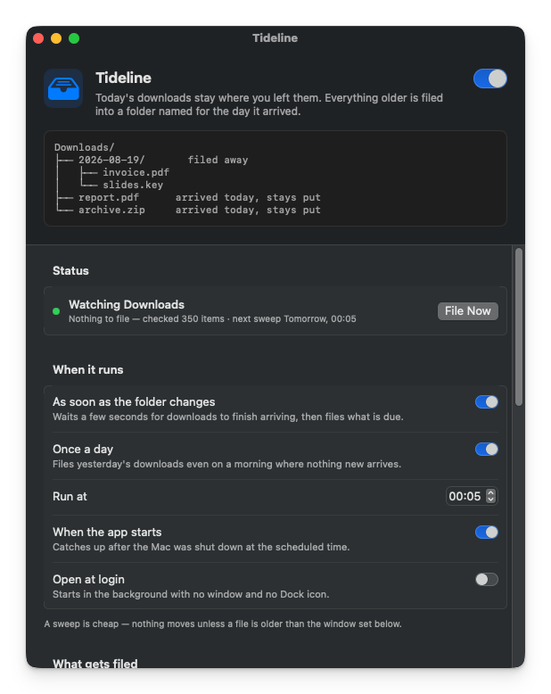

# Tideline

Keeps `~/Downloads` tidy without hiding what you just downloaded.

Today's files stay loose in the root where you expect them. Everything older
gets filed into a `YYYY-MM-DD` folder named for the day it was downloaded. When
the day rolls over, yesterday's files move into yesterday's folder on their own.

```
~/Downloads/
├── 2026-08-17/
│   └── invoice.pdf
├── 2026-08-18/
│   ├── slides.key
│   └── screenshot.png
├── report.pdf          ← downloaded today, stays put
└── archive.zip         ← downloaded today, stays put
```

macOS 13 or later. A native 1.7 MB app — no Electron, no runtime, no helper
daemon. It schedules itself and sits in the menu bar.



**[Download the latest release](https://github.com/estruyf/tideline/releases/latest)**

## Why

Downloading the same build artifact from GitHub twice is all it takes. The second
one lands as `artifact-1.zip`, the third as `artifact-2.zip`, and now the name no
longer tells you anything. So you make a folder, drag the new file into it,
rename it back to what it was meant to be, and only then start working with it.

None of that takes long. It is just cumbersome, every single time.

Hence the idea: what if the Downloads folder were always clean? Not empty —
clean. Everything that came before sits in its own folder, so the moment you
download something it is the only thing in the root, under its real name, ready
to work with.

## Why it is an app and not a script

The obvious way to build this is a script on a timer. The problem is permissions:
a script runs as whatever launched it, so macOS asks *that* process for access.
In practice that means granting **Full Disk Access** to `bash`, your terminal or
launchd — a blunt, all-or-nothing switch that is awkward to explain and easy to
get wrong.

An app bundle has its own identity, so macOS asks a single, specific question:

> **"Tideline" would like to access files in your Downloads folder.**

One click, scoped to one folder, revocable in System Settings. Nothing else on
the disk becomes reachable.

## Install

Grab the zip from the [latest release](https://github.com/estruyf/tideline/releases/latest),
unzip it, and drag **Tideline.app** into `/Applications`. Or build it yourself:

```bash
npm run build:install    # builds, signs, copies to /Applications, opens it
```

`npm run build` on its own leaves the app in `app/dist/`. Requires Xcode or the
Command Line Tools; it produces a universal (Apple silicon + Intel) binary
stamped with the version from `package.json`.

### Versioning

`package.json` is the single source of truth. `build.sh` reads the version from
it, so the bundle's `CFBundleShortVersionString` always matches:

```bash
npm version patch      # 1.0.0 -> 1.0.1, rebuilds, then commits and tags
```

The `version` lifecycle script rebuilds the app as part of the bump, so the
bundle in `app/dist/` matches the tag rather than lagging a release behind. A
failed build aborts the bump before anything is committed.

`CFBundleVersion` is a build timestamp, regenerated on every build. Override
either value for a one-off build with `VERSION=` or `BUILD_NUMBER=`.

| Script | |
| --- | --- |
| `npm run build` | Build into `app/dist/` |
| `npm run build:install` | Build, copy to `/Applications`, open it |
| `npm run build:zip` | Build and zip it for release |
| `npm run logs` | Follow the app's log |
| `npm run quit` | Quit the running app |
| `npm run clean` | Throw away build artefacts |
| `npm run sign` | Build signed with your Developer ID, then zip |
| `npm run notarize` | Sign, notarize with Apple, staple, zip |
| `npm version patch` | Bump the version, rebuild, commit and tag |

### Signing and notarizing

An ad-hoc build runs fine on the machine that built it. To hand it to anyone
else it needs to be signed with a **Developer ID Application** certificate *and*
notarized by Apple — signing alone still trips Gatekeeper.

One-time setup, using an [app-specific password](https://support.apple.com/en-us/102654):

```bash
xcrun notarytool store-credentials tideline \
  --apple-id you@example.com --team-id TEAMID --password <app-specific-password>
```

Then per release:

```bash
npm run notarize
```

That signs with the hardened runtime and a secure timestamp, uploads the zip,
waits for the ticket, staples it to the app, re-zips the stapled bundle, and
finishes with `spctl --assess` so you know Gatekeeper accepts it before you
publish it.

The identity is picked from your keychain automatically; override it with
`CODESIGN_IDENTITY=`, and the notary profile name with `NOTARY_PROFILE=`.
Stapling has to happen on the `.app` rather than the zip, which is why the
archive is rebuilt at the end — ship the zip produced *after* that step.

### Releasing from GitHub Actions

[`.github/workflows/release.yml`](.github/workflows/release.yml) builds, signs,
notarizes and staples on a macOS runner whenever a release is **published**, then
attaches `Tideline-<version>-macos-universal.zip` to that release and keeps
it as a build artifact for 90 days. `workflow_dispatch` runs it by hand without
touching a release.

It needs five repository secrets (**Settings → Secrets and variables → Actions**):

| Secret | What it is |
| --- | --- |
| `MACOS_CERTIFICATE` | Developer ID Application `.p12`, base64-encoded |
| `MACOS_CERTIFICATE_PWD` | Password you set when exporting the `.p12` |
| `APPLE_ID` | Apple ID email for the developer account |
| `APPLE_TEAM_ID` | Ten-character team ID |
| `APPLE_APP_PASSWORD` | App-specific password, not the Apple ID password |

Export the certificate from **Keychain Access → My Certificates**, right-click
the *Developer ID Application* entry → *Export*, save as `.p12` with a password,
then encode it:

```bash
base64 -i Certificates.p12 | pbcopy
```

The workflow imports it into a throwaway keychain, builds, and removes it again
on the way out, whether the build passed or failed.

A release cuts like this:

```bash
npm version patch        # bumps, rebuilds, commits, tags
git push --follow-tags
gh release create v1.0.1 --generate-notes
```

The workflow refuses to build if the tag and `package.json` disagree, so a
mistagged release fails fast instead of shipping a mislabelled bundle.

There is no npm dependency here — `package.json` is only a shortcut to
`app/build.sh`, which you can call directly just as well.

## First launch

The window opens and the app immediately asks macOS for access to your Downloads
folder. Allow it — without it the app can see nothing and moves nothing.


If you dismissed the prompt, the window shows an orange banner with an **Open
Privacy Settings** button. Switch on *Downloads Folder* for Tideline under
**Privacy & Security › Files and Folders**, then quit and reopen the app.

## The window

**Status** — whether filing is on, when it last ran, what it did, and when the
next sweep is due. **File Now** runs one immediately.

**When it runs** — any combination of:

| Setting | What it does |
| --- | --- |
| As soon as the folder changes | Watches `~/Downloads` and sweeps once things go quiet for 8 seconds |
| Once a day, at a time you pick | Default 00:05, so yesterday's files get filed on a quiet morning |
| When the app starts | Covers a scheduled run missed because the Mac was off |
| Open at login | Starts in the background at login, no window, no Dock icon |

A run that is missed while the Mac sleeps fires as soon as it wakes.

**What gets filed**

| Setting | Options |
| --- | --- |
| Folder | `~/Downloads` by default; pick any folder |
| Leave loose in the root | Today only, today and yesterday, the last 3 days, the last week |
| Folder name | One folder per day (`2026-08-19`) or per month (`2026-08`) |
| Sort by | Date added to disk, or date last modified |
| File folders too | Whether downloaded folders move like files |
| Preview mode | Logs what *would* move and touches nothing |

**Never touch these** — exact names (`Inbox`) or patterns (`*.dmg`). On top of
your list, the app always leaves alone: today's downloads, hidden files, partial
downloads (`.crdownload`, `.download`, `.part`, `.partial`, `.opdownload`,
`.tmp`, `.temp`, `.aria2`, Safari's `.download` bundles), anything written to in
the last 30 seconds, and the dated folders it created itself.

**Recent activity** — the last dozen moves, with a link to the full log at
`~/Library/Logs/Tideline.log`.

**About** — the version and build number (quote them in a bug report), plus
links to the [source](https://github.com/estruyf/tideline),
[issues](https://github.com/estruyf/tideline/issues) and the author.

Nothing is ever overwritten. A name that is already taken in the target folder
becomes `report-1.pdf`, `report-2.pdf`, and so on.

## In the background

Closing the window drops the Dock icon; the app keeps running and keeps filing.
The menu bar icon stays. Its menu opens with the name and version, then the last
run, **File Downloads Now**, a **Filing Enabled** switch, **Open Downloads
Folder**, **Settings…**, **Send Feedback…** and **Quit**.

Launched at login it starts with no window and no Dock icon at all. Clicking the
app in Finder or Launchpad brings the window back.

## Uninstall

In the app: **Other › Uninstall…**. It removes the login item, its settings, the
history and the log, then quits and opens Finder on the app so you can drag it
to the Trash.

By hand, if you would rather:

```bash
osascript -e 'quit app "Tideline"'
rm -rf "/Applications/Tideline.app"
rm -rf "$HOME/Library/Application Support/Tideline"
rm -f  "$HOME/Library/Logs/Tideline.log"
defaults delete be.eliostruyf.Tideline
```

Then, optionally, remove the leftovers macOS keeps:

- **System Settings › General › Login Items** — remove Tideline if it is
  still listed.
- **System Settings › Privacy & Security › Files and Folders** — remove its
  Downloads Folder permission.

Your downloads and every dated folder stay exactly where they are. Uninstalling
never moves a file back.

## Distributing it

Ad-hoc signing (the default) is fine on your own Mac, but anyone else will hit
Gatekeeper. For a build other people can open:

```bash
CODESIGN_IDENTITY="Developer ID Application: Your Name (TEAMID)" npm run build:zip

xcrun notarytool submit "app/dist/Tideline.zip" \
  --apple-id you@example.com --team-id TEAMID --password "app-specific-password" \
  --wait
xcrun stapler staple "app/dist/Tideline.app"
```

Re-zip after stapling and ship that. Signing also keeps the granted permission
stable across updates — an ad-hoc signature changes on every rebuild, so macOS
treats each build as a new app and asks again.

---

## Troubleshooting

**Nothing moves.** Check the Status row in the app. An orange dot means macOS is
blocking access — see [First launch](#first-launch). A grey dot means filing is
paused.

**Files are filed under the wrong day.** The day comes from the date the file
landed on disk, so something copied or restored from elsewhere carries the date
of the copy. Switch *Sort by* to *Date last modified* if that suits you better.

**A file stayed put that should have moved.** Anything written to in the last 30
seconds is left alone, on the assumption that something is still filling it in.
The next sweep picks it up.
