# Tideline

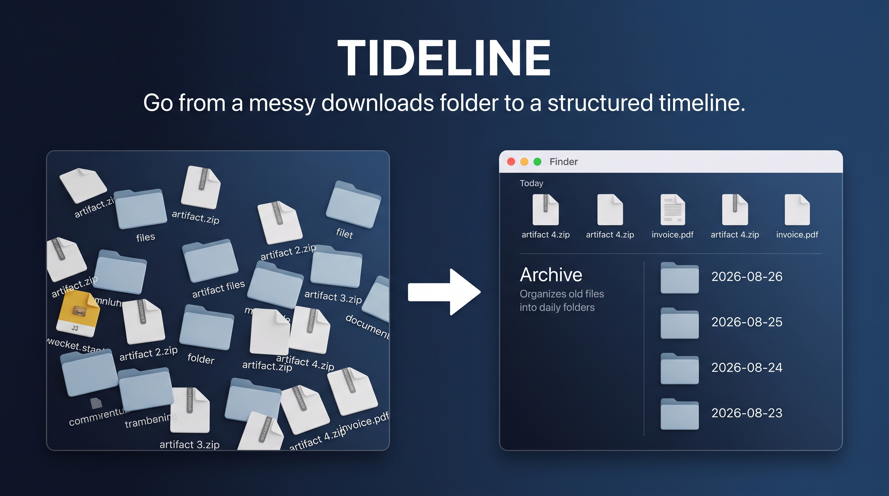

**A tidy Downloads folder, every morning, without hiding what you just
downloaded.** Today's files stay loose in the root where you expect them.
Everything older is filed into a `YYYY-MM-DD` folder named for the day it
arrived — when the day rolls over, yesterday's files move on their own.

Download the same build artifact from GitHub twice and the second one lands as
`artifact-1.zip`, the third as `artifact-2.zip`, and the name no longer tells
you anything. So you make a folder, drag the new file into it, rename it back to
what it was meant to be, and only then start working with it. Tideline is that
folder, made for you every day.

```
~/Downloads/
├── 2026-08-17/
│   └── invoice.pdf
├── 2026-08-18/
│   ├── slides.key
│   └── screenshot.png
├── report.pdf          ← downloaded today, stays put
└── archive.zip         ← downloaded today, stays put
```

**[Download for macOS](https://github.com/estruyf/tideline/releases/latest)** —
macOS 14 or later. Free, open source, no account, no telemetry.

Native Swift with no dependencies at all: 1.7 MB to download, 5.8 MB on disk
because it ships for both Apple silicon and Intel. No Electron, no bundled
runtime, no helper process quietly installed beside it — one menu bar app that
schedules itself, and quitting it really is the end of it.

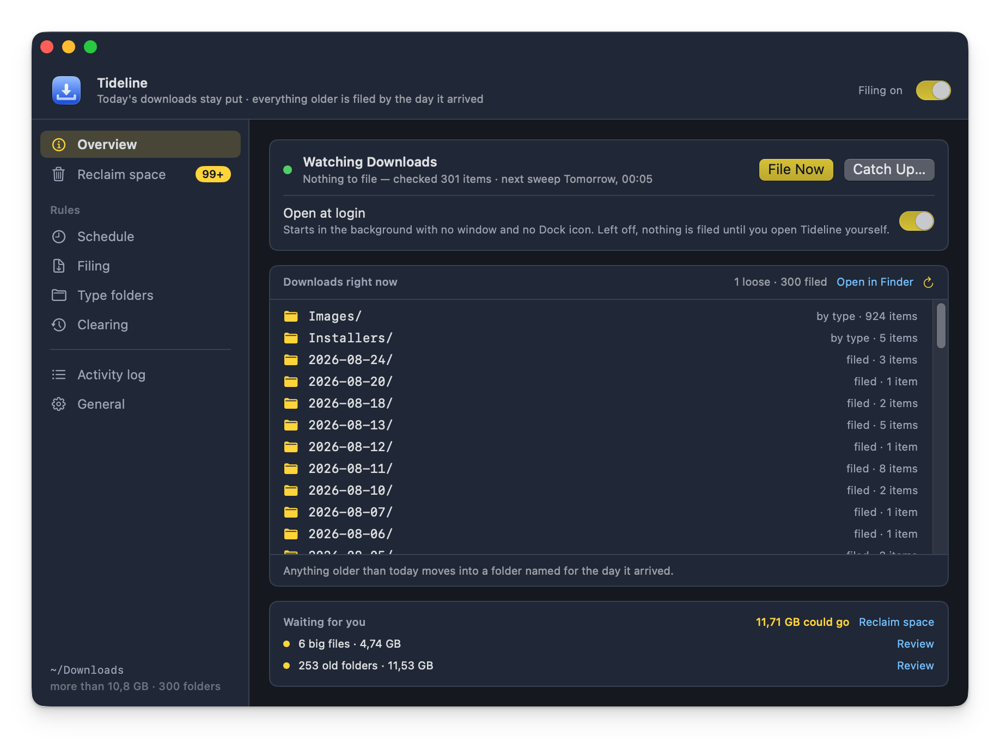

> **Windows.** A Windows build is in progress under [`windows/`](./windows) —
> the same filing rules, rewritten in Rust with a [Tauri](https://tauri.app)
> window and tray icon. The filing engine is done and tested; clearing,
> duplicates and the big-file review are not yet. The macOS app is unaffected by
> it. See [the Windows README](./windows/README.md) for what works and what is
> still to come.

## Why

Making the folder, dragging the file in, renaming it back — none of that takes
long. It is just cumbersome, every single time.

Hence the idea: what if the Downloads folder were always clean? Not empty —
clean. Everything that came before sits in its own folder, so the moment you
download something it is the only thing in the root, under its real name, ready
to work with.

## Why it is an app and not a script

The obvious way to build this is a script on a timer. The problem is permissions:
a script runs as whatever launched it, so macOS asks *that* process for access.
In practice that means granting **Full Disk Access** to `bash`, your terminal or
launchd — a blunt, all-or-nothing switch that is awkward to explain and easy to
get wrong.

An app bundle has its own identity, so macOS asks a single, specific question:

> **"Tideline" would like to access files in your Downloads folder.**

One click, scoped to one folder, revocable in System Settings. Nothing else on
the disk becomes reachable.

## Install

Grab the zip from the [latest release](https://github.com/estruyf/tideline/releases/latest),
unzip it, and drag **Tideline.app** into `/Applications`.

Once it is in `/Applications` it keeps itself current: Tideline looks for a
newer release once a day and offers it — see [Updates](#updates).

Prefer to build it yourself? See [Building](./docs/building.md).

## First launch

The window opens and the app immediately asks macOS for access to your Downloads
folder. Allow it — without it the app can see nothing and moves nothing.

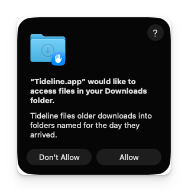

If you dismissed the prompt, the window shows an orange banner with an **Open
Privacy Settings** button. Switch on *Downloads Folder* for Tideline under
**Privacy & Security › Files and Folders**, then quit and reopen the app.

The window also offers to start Tideline at login, since filing only happens
while the app is running. **Open at Login** switches it on; **Not Now** hides
the suggestion for good. Either way the same switch stays on the **General**
pane.

## The window

A band across the top that stays put — the app's name, what it does in one
line, and the master on/off switch — with a sidebar down the left and one pane
at a time beside it. If macOS is blocking access, an orange banner sits under
the band, above everything. The sidebar's foot always says which folder this is
all about and what it is holding, whichever pane is open.

The palette is the app's own rather than the system accent — `#ffd43b` on the
surfaces that come with it, from the [Demo Time
theme](https://github.com/estruyf/vscode-demotime-theme). It still follows Light
and Dark mode: every colour has both. Yellow marks what Tideline put there and
what it is about to touch — a filled button, the selected pane, the folders it
made, a file due to move. Red is kept for faults, blue for a button that only
navigates, green for running and watching.

### Overview

Whether filing is on, when it last ran, what it did, and when the next sweep is
due. **File Now** runs one immediately; **Catch Up…** is beside it once a type
folder is switched on. **Open at login** sits in the same card, because filing
only happens while the app is running and that switch decides whether it is.

Under that, the folder as it stands right now — the type folders, the dated
folders newest first, then whatever is still loose, each one saying what it is
and whether the next sweep would move it. The window used to draw a sketch of a
tidy Downloads folder here, which was the same picture whatever was actually in
there; this is the real one. What it marks as due comes from the same planner a
sweep uses, so the panel and a sweep cannot disagree about a file.

Across the bottom, **Waiting for you**: what the scans turned up, how much of it
could go, and a link straight into the review that deals with each. Filing tidies
a folder; it does not shrink one, and this is the line that says so. The folder's
own size is in the corner of the sidebar, where it is true on every pane.

### Reclaim space

Filing never removes anything, so everything that could give space back is in
one place: duplicates, big files, and dated folders old enough to clear. Each
shows what it found and the top few rows of it, with the review that decides
what actually goes.

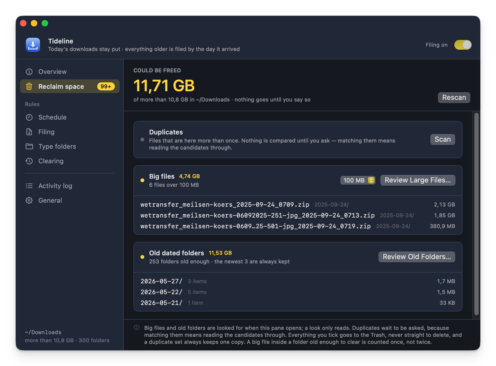

Two of the three look on their own. Big files and old dated folders are found by
reading names, sizes and dates — a directory listing and a walk, neither of which
opens a file — so they run when the window opens and the answer is already there
when you arrive. **Duplicates keep their button.** Matching copies means hashing
them, which means reading the candidates end to end, and that is not something to
start behind your back.

**Rescan** at the top looks again, duplicates included. A scan is also thrown
away whenever the answer could have moved — after a sweep, after anything goes to
the Trash, after a setting that governs it changes — so the next look is a fresh
one rather than a figure from before the folder shifted underneath it.

**Could be freed** adds the three up. They overlap — a big file can sit inside a
folder old enough to clear, and a duplicate copy can be both — so each byte is
counted once, by the widest thing that would take it. Nothing here moves on its
own: a look only reads, and everything you tick afterwards goes to the Trash
rather than being deleted outright.

Underneath it is what the folder holds, which is measured up to 60,000 items and
then reported as a floor — walking a folder past that takes long enough to be
worth asking about. A folder that big says so instead of quoting a total the
scans above it can outgrow, and **Scan the folder in full** walks the rest: the
same reading walk, only allowed to finish, and the exact figure stands for the
rest of the session.

**The same file, more than once.** Downloading the same file twice is what a
Downloads folder does. The second one lands as `artifact-1.zip`, the third as `artifact-2.zip`,
and the name stops telling you anything. **Review Duplicates…** finds them: it
compares the root and the folders Tideline made, groups files whose names match
once a copy suffix is taken off, and reads through the ones that also match in
size to check they really are the same file, byte for byte. Two files that
merely look alike are never called copies.

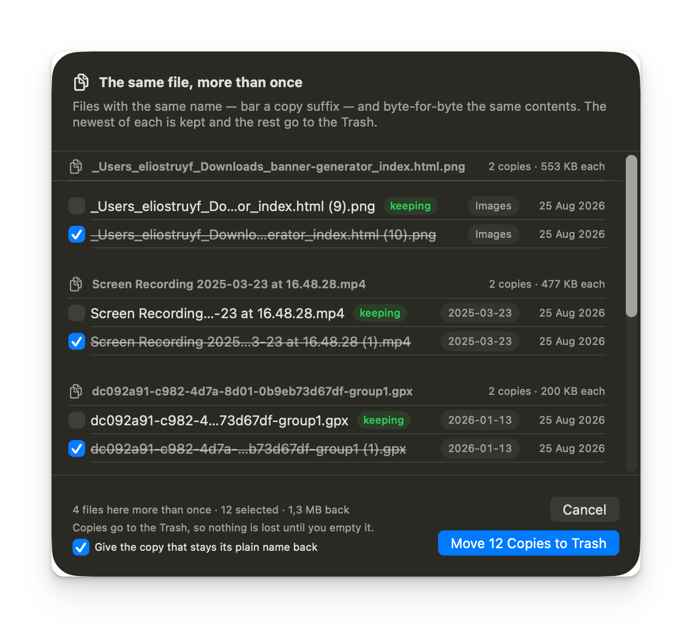

Each group starts with the newest copy kept and the rest ticked for the Trash;
untick anything you would rather hold on to. A group always keeps a copy — the
last one standing cannot be ticked. Nothing is compared until you ask, nothing
goes until the sheet says so, and everything goes to the Trash rather than being
deleted outright.

With the other copies gone, the one that stays can have its plain name back:
`artifact-1.zip` becomes `artifact.zip`, but only where that name is free.
Switch that off in the sheet if you would rather it kept the name it has. A
dated folder left empty by the removals goes to the Trash, as it does after
catching up; a type folder is left alone either way. Preview mode previews it.

**What is taking up the room.** Clearing goes by age; this goes by size. Filing
tidies a folder, it never shrinks one, and a hundred neatly dated PDFs are not what is taking up
the space. **Review Large Files…** lists the biggest files in the root and in
the folders Tideline made, largest first, with the folder each one sits in and
the day it arrived.

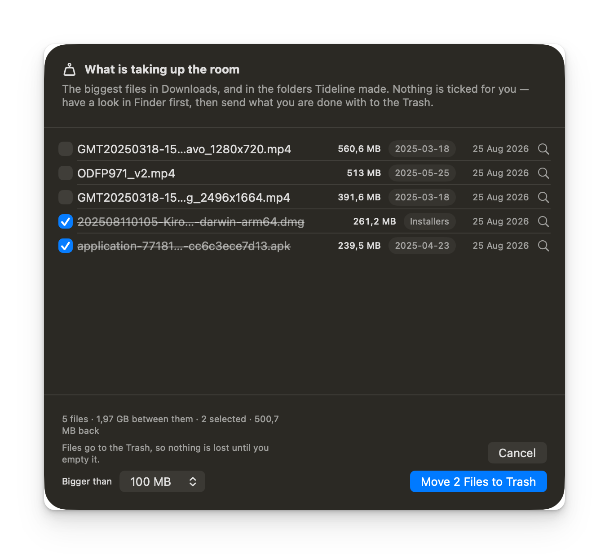

Nothing starts ticked. A duplicate always leaves a copy behind; a big file is
the only copy there is, so each one is a deliberate choice — and the magnifier
at the end of a row opens it in Finder, because "can this go?" is usually
answered by looking at the thing rather than at its name. The footer keeps a
running total of what ticking them would give back.

**Bigger than** sets the size — 50 MB up to 5 GB, 100 MB to begin with. It sits
in the sheet as well as in settings, so you can turn it down until the list has
something in it and back up when it has too much.

The same rules as everywhere else: only plain files, only the root and the
folders Tideline made — a folder you made yourself is never looked in, and
neither is anything on the skip list or still downloading. What you tick goes to
the **Trash**, and a dated folder the removals leave empty goes with it. Preview
mode previews it. It is on the menu bar too, under **Reclaim space**.

### Schedule

Any combination of:

| Setting | What it does |
| --- | --- |
| As soon as the folder changes | Watches `~/Downloads` and sweeps once things go quiet for 8 seconds |
| Once a day, at a time you pick | Default 00:05, so yesterday's files get filed on a quiet morning |
| When the app starts | Covers a scheduled run missed because the Mac was off |

A run that is missed while the Mac sleeps fires as soon as it wakes.

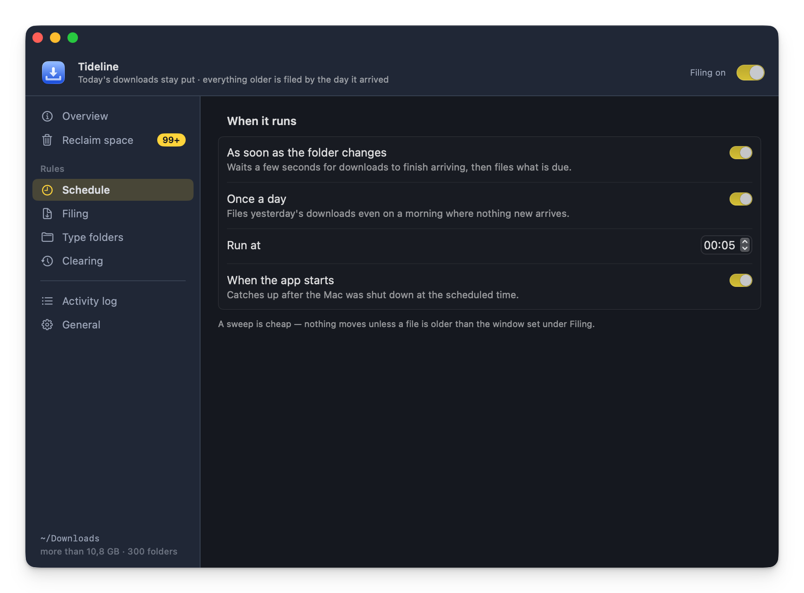

### Filing

| Setting | Options |
| --- | --- |
| Folder | `~/Downloads` by default; pick any folder |
| Leave loose in the root | Today only, today and yesterday, the last 3 days, the last week |
| Folder name | One folder per day (`2026-08-19`) or per month (`2026-08`) |
| Sort by | Date added to the folder (Finder's "Date Added"), date created, or date last modified |
| File folders too | Whether downloaded folders move like files |
| Preview mode | Shows what *would* move and touches nothing |

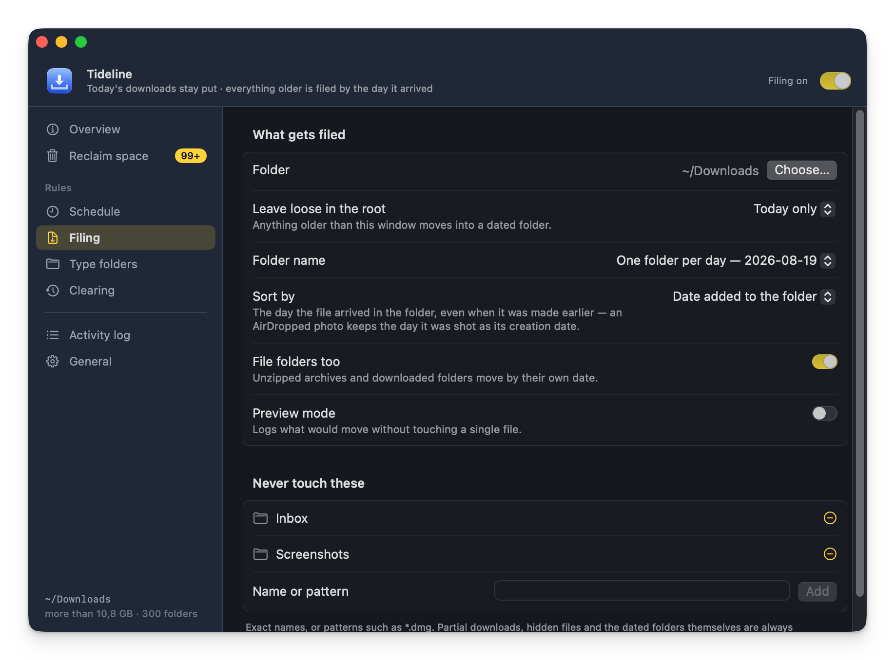

**Preview mode** — a sweep that touches nothing. **Preview Now**, on the
*Overview* pane or in the menu bar, walks the folder exactly as a real sweep
would and then shows what it would have done: every item, grouped by the folder it
would have landed in, with what that adds up to. It is still written to the log
as before.

**Never touch these** — exact names (`Inbox`) or patterns (`*.dmg`). It starts
with `Inbox` and `Screenshots`; both can go. On top of your list, the app always
leaves alone: today's downloads, hidden files, partial downloads
(`.crdownload`, `.download`, `.part`, `.partial`, `.opdownload`, `.tmp`,
`.temp`, `.aria2`, Safari's `.download` bundles), anything written to in the
last 30 seconds, and the dated folders it created itself.

### Type folders

A folder at the root that takes everything with one of its extensions, instead
of the dated folder. Switch on `Installers` and every
`.dmg`, `.pkg`, `.mpkg`, `.iso` and `.app` lands in `~/Downloads/Installers/`,
whatever day it arrived on:

```
~/Downloads/
├── Installers/
│   ├── Figma.dmg
│   └── node.pkg
├── 2026-08-18/
│   └── invoice.pdf
└── report.pdf          ← downloaded today, stays put
```

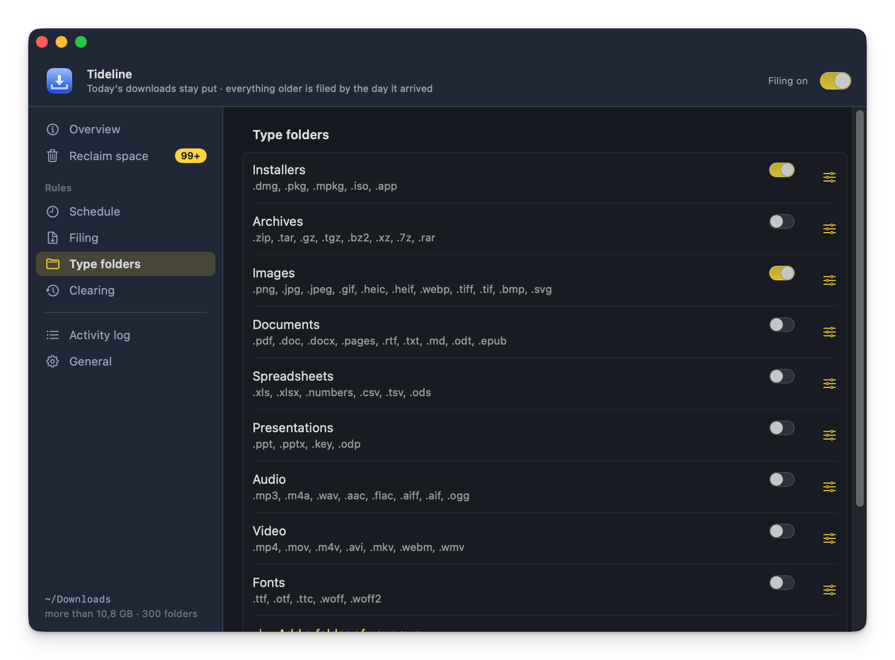

The app ships with `Installers`, `Archives`, `Images`, `Documents`,
`Spreadsheets`, `Presentations`, `Audio`, `Video` and `Fonts`, **all switched
off** — nothing changes until you turn one on. Any of them can be renamed or
re-scoped, and **Add a folder of your own** takes a name and a list of
extensions (`torrent, magnet`) for anything the list does not cover.

Switching a folder on only steers what arrives next — files already tucked into
a dated folder stay there. **Catch Up…** brings them into line: it looks through
the dated folders, shows you everything the rules now claim grouped by where it
would go, and moves only what you leave checked. A dated folder left empty by
that goes to the Trash. Folders you made yourself are never opened, and a name
already taken in the type folder is never overwritten — `report.pdf` arrives as
`report-1.pdf`.
A type folder decides *where* something goes, not *when*. A `.dmg` downloaded
today still sits loose in the root until it is older than the **Leave loose in
the root** window — it just goes to `Installers/` rather than to a dated folder
when its time comes. Type folders are flat, they are never filed away
themselves, and **Clearing** never touches them: only dated folders are ever
cleared. Where two folders claim the same extension, the one higher up the list
takes it, and the window says so.

### Clearing

Old dated folders can go to the Trash once you have stopped
needing them. Age is the narrower of the two ways to go about it, and the only
one that can be left to run on its own:

| Setting | Options |
| --- | --- |
| Clear dated folders | Never, or older than a month, three months (default), six months, a year |
| Always keep | The newest 1, 3 (default), 5 or 10 folders, whatever their age |
| Clear on the daily sweep | Off by default — see below |

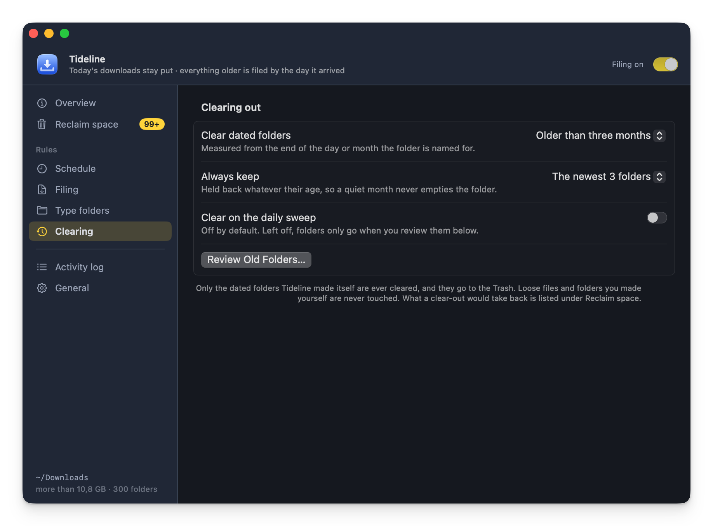

Left as it comes, nothing is ever removed on its own: the age setting only
decides what shows up when you go looking.

**Review Old Folders…** lists everything that qualifies with its item count and
size, all of it ticked. Untick anything you want to keep, then **Move n Folders
to Trash**. Nothing is removed until you press that button.

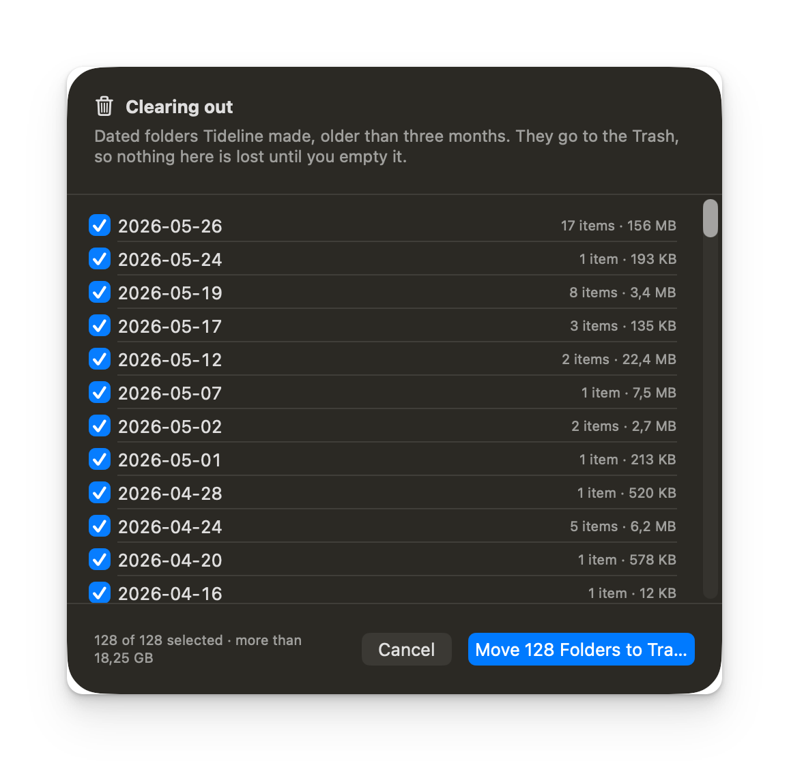

Switching on *Clear on the daily sweep* lets it happen unattended as part of the
once-a-day run — never on a folder change, so a download landing can never
trigger a removal.

Three rules make this safe to leave on:

- Only folders matching `YYYY-MM-DD` or `YYYY-MM` — the ones Tideline made
  itself — are ever considered. Loose files, and folders you named yourself, are
  invisible to it.
- Age comes from the folder's *name*, measured from the end of the day or month
  it covers, so a folder is never cleared sooner than its name suggests. The
  folder's own timestamp is ignored; filing bumps that every time it drops
  something new inside.
- Folders go to the **Trash**, never straight to `unlink`. A setting you regret
  is a drag back out of the Trash, not a restore from backup.

Preview mode covers this too: it lists what would go and leaves it all in place.

What the age you set is actually worth — how many folders qualify and what they
add up to — is on *Reclaim space*, alongside the other two scans.

### Activity log

The last few hundred things Tideline moved, cleared or renamed, newest first,
each with the folder it landed in. The full record, sweep by sweep, is the log
file at `~/Library/Logs/Tideline.log` — **Open Log File** under *General*.

### General

A notification when files are filed, whether the folder's size sits next to the
menu bar icon, buttons for the log and the Downloads folder, and **Uninstall…**. Then [Updates](#updates), and below that the version
and build number (quote them in a bug report), plus links to the
[source](https://github.com/estruyf/tideline),
[issues](https://github.com/estruyf/tideline/issues) and the author.

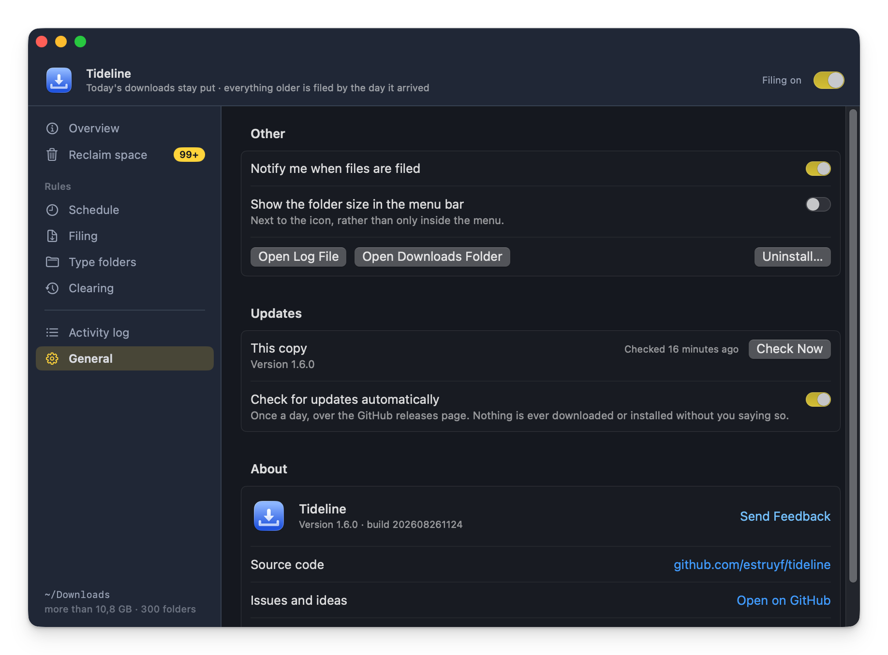

#### Updates

Tideline checks the [GitHub releases](https://github.com/estruyf/tideline/releases)
page for a newer version once a day, and **Check Now** asks straight away. The
check reads one public endpoint and sends nothing about you or your files.

When there is something newer, the **Overview** pane and the menu bar say so, and
**Update & Restart** does the rest: it downloads the release build, unpacks it,
and only installs it once the copy passes three tests — it is Tideline, it is
the version the release advertised, and it carries the same Developer ID
signature and Apple notarisation as the copy you are running. Anything less and
the download is thrown away untouched.

The swap itself is the last step. The app quits, the new bundle replaces the old
one, and Tideline reopens on the new version. If the copy fails halfway the old
app is put straight back and reopened, so a bad download never leaves you
without the app.

When a check that ran on its own finds something newer, Tideline also says so
in Notification Centre, once per version, so a new release does not wait for you
to open the window. *Notify me when a new version is out* switches that off; it
appears only where notifications were already allowed, since finding an update
is never a reason to raise a permission prompt.

Nothing downloads or installs on its own — a check only ever offers.
**Skip This Version** silences one release without silencing the next, and
*Check for updates automatically* switches the daily look off entirely. If the
app cannot replace itself — it sits somewhere you cannot write to, or macOS is
running it from a read-only quarantine copy — it says so and points you at the
releases page.

Nothing is ever overwritten. A name that is already taken in the target folder
becomes `report-1.pdf`, `report-2.pdf`, and so on.

## In the background

Closing the window drops the Dock icon; the app keeps running and keeps filing.
The menu bar icon stays. Its menu opens with the name and version, then the last
run and what the folder is holding, **File Downloads Now**, **Open Tideline**, a
**Filing Enabled** switch, **Reclaim space**, **Open Downloads Folder**,
**Settings…**, **Help & Updates** and **Quit**.

**Reclaim space** holds the three reviews — **Duplicates**, **Large files** and
**Old dated folders** — with **Review All in Tideline…** at the foot, which
opens the pane and starts the scans. The menu itself never scans and quotes no
figures: what it could show would be as old as the last time the window was
open. **Help & Updates** holds
**Check for Updates…**, **Send Feedback…** and **Tideline on GitHub**, and wears
a badge when there is a new version.

**Open Tideline** (⌘O) brings the window up on whichever pane you left it on.
**Settings…** (⌘,) opens the same window on *Filing*, since the rules are what
you press ⌘, looking for. **Open Downloads Folder** is ⌘D.

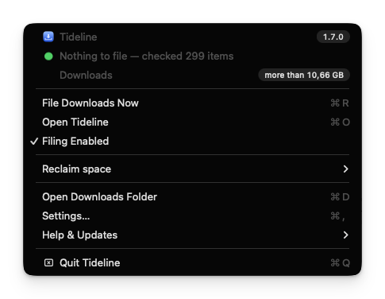

**File Downloads Now** reads **Preview a Sweep…** while preview mode is on, and
opens the window on the sheet that lists what a sweep would have moved.

The size can sit next to the icon as well as inside the menu — **General ›
Other › Show the folder size in the menu bar**, off by default.

**Check for Updates…** reads **Update to 1.3.0…** once a check has found one,
so a new version is visible without opening the window.

All three **Review…** items bring the window up on their sheet rather than
removing anything where you cannot see it. **Review Old Folders…** is greyed out
while clearing is set to *Never*.

Launched at login it starts with no window and no Dock icon at all. Clicking the
app in Finder or Launchpad brings the window back.

## Uninstall

In the app: **General › Other › Uninstall…**. It removes the login item, its
settings, the history and the log, then quits and opens Finder on the app so you
can drag it to the Trash.

By hand, if you would rather:

```bash
osascript -e 'quit app "Tideline"'
rm -rf "/Applications/Tideline.app"
rm -rf "$HOME/Library/Application Support/Tideline"
rm -f  "$HOME/Library/Logs/Tideline.log"
defaults delete be.eliostruyf.Tideline
```

Then, optionally, remove the leftovers macOS keeps:

- **System Settings › General › Login Items** — remove Tideline if it is
  still listed.
- **System Settings › Privacy & Security › Files and Folders** — remove its
  Downloads Folder permission.

Your downloads and every dated folder stay exactly where they are. Uninstalling
never moves a file back.

## Troubleshooting

**Nothing moves.** Check the status row on *Overview*. An orange dot means macOS is
blocking access — see [First launch](#first-launch). A grey dot means filing is
paused.

**Files are filed under the wrong day.** The day comes from the date the file
landed on disk, so something copied or restored from elsewhere carries the date
of the copy. Switch *Sort by* to *Date last modified* if that suits you better.

**A file stayed put that should have moved.** Anything written to in the last 30
seconds is left alone, on the assumption that something is still filling it in.
The next sweep picks it up.

**"Unable to expand … It is in an unsupported format."** You downloaded the
build artifact from the Actions run page rather than the zip attached to the
release. GitHub wraps every artifact in a zip of its own, so that download is a
zip inside a zip — unpack it twice. Take the asset from the
[latest release](https://github.com/estruyf/tideline/releases/latest) instead;
it is the app, zipped once.

## Build it yourself

The app is a single SwiftPM executable and a shell script — no npm dependencies,
no project file.

- [Building](./docs/building.md) — requirements, scripts, versioning, layout
- [Signing and notarizing](./docs/signing.md) — handing a build to other Macs
- [Releasing](./docs/releasing.md) — the GitHub Actions workflow and its secrets
- [Filing behaviour](./docs/behaviour.md) — the rules both platforms implement
- [Windows](./windows/README.md) — the Tauri build, and where the two differ

What changed per version is in the [changelog](./CHANGELOG.md).

## 🔑 License

[MIT](./LICENSE)

<br />
<br />

<p align="center">
<a href="https://visitorbadge.io/status?path=https%3A%2F%2Fgithub.com%2Festruyf%2Ftideline"></a>
</p>
